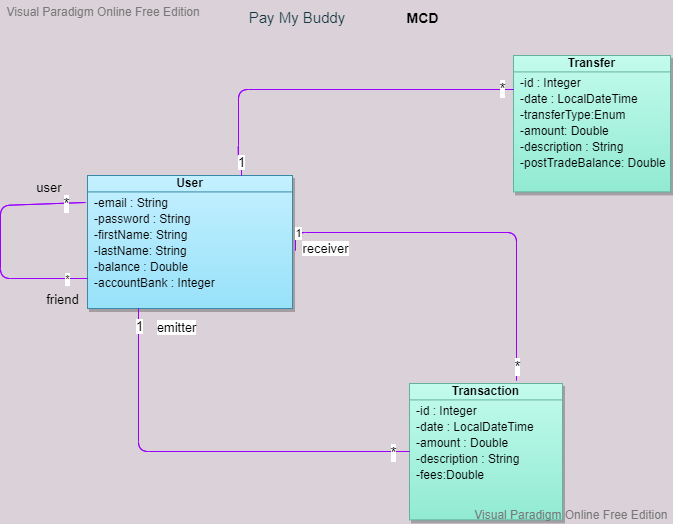

# PayMyBuddy

An application that allowed customers to transfer money to manage their finances or pay their friends

Getting Started
These instructions will get you a copy of the project up and running on your local machine. See deployment for notes on how to deploy the project on a live system.

Prerequisites
What things you need to install the software and how to install them

Java 1.8
Maven 3.6.2
Mysql 8.0.17
Installing
A step by step series of examples that tell you how to get a development env running:

1.Install Java:

https://docs.oracle.com/javase/8/docs/technotes/guides/install/install_overview.html

2.Install Maven:

https://maven.apache.org/install.html

3.Install MySql:

https://dev.mysql.com/downloads/mysql/

After downloading the mysql 8 installer and installing it, you will be asked to configure the password for the default root account. This code uses the default root account to connect and the password can be set as rootroot.

Running App
Post installation of MySQL, Java and Maven, you will have to set up the tables and data in the data base. For this, please run the sql commands present in the schema.sql and schemaTest.sql(database for tests) file under the resources folder in the code base.

Finally, you will be ready to import the code into an IDE of your choice and run the PayMyBuddy.java to launch the application.

**The code is located on the branch release.**

**_Modèle Conceptuel de données_**

**_Modèle Logique de données_**

**_Modèle physique de données_**

